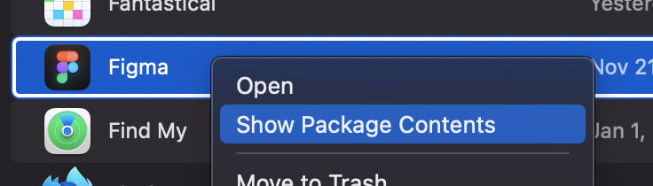
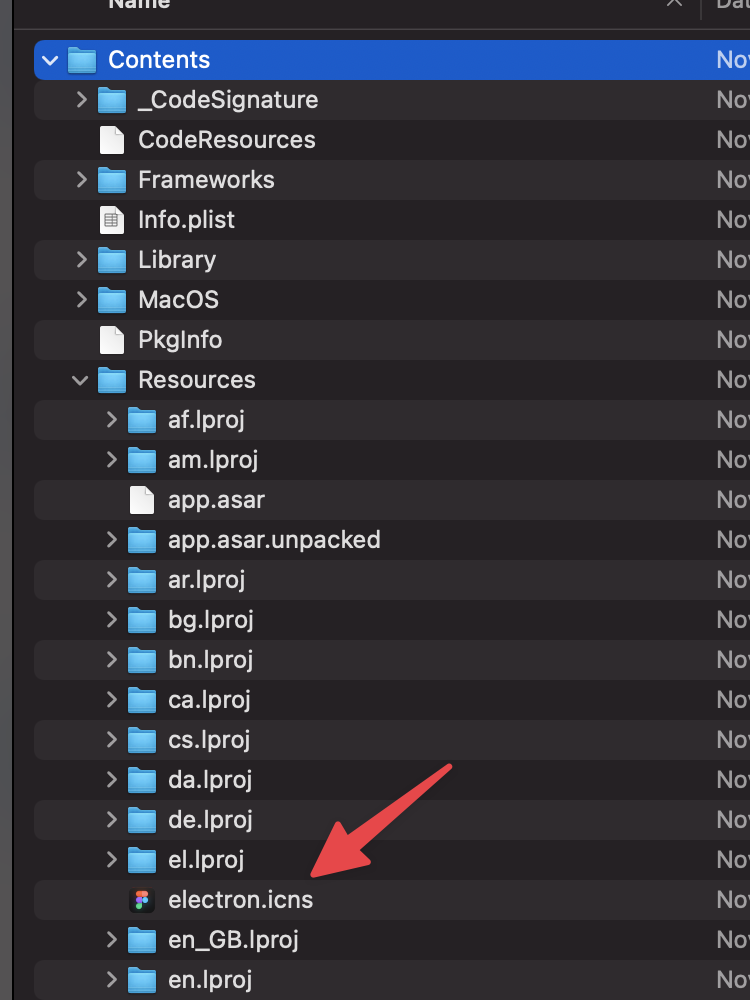

# Dockhunt CLI

[Website](https://www.dockhunt.com) ⋅ [Twitter](https://twitter.com/dockhuntapp) ⋅ [npm](https://www.npmjs.com/package/dockhunt)

Scans which apps you have in your macOS dock and shares the result with
Dockhunt.

[](https://www.dockhunt.com)


This repository is for the CLI tool. The resposity for the Dockhunt web
application is: [https://github.com/Basedash/dockhunt](https://github.com/Basedash/dockhunt)

## Usage

### Option 1: Basic users

Download and use the [Dockhunt Mac app](https://www.dockhunt.com/add-dock).

Note: To create the Mac app, we first build an executable and then we've been
using [Platypus](https://sveinbjorn.org/platypus) to package it into a macOS
app bundle.

### Option 2: JavaScript developers

Run the following command from your terminal

```
npx dockhunt
```

You can find the [dockhunt package](https://www.npmjs.com/package/dockhunt) on
npm.

## What does it do?
1. Scans your macOS dock
   - For each app, find its name and the best-guess path to its icon file
     - Using `defaults export com.apple.dock -` (see `defaults help`)
   - Converts each icon file from `.icns` to `.png`
   - Checks if your dock contains any apps not yet known to Dockhunt
     - For any apps not yet known to Dockhunt, it uploads the app names and PNGs
2. Opens the Dockhunt website in your browser
   - You'll be invited to authenticate with Twitter to add your dock to the site
   - You can share your dock and see who else has the same apps in their dock

# Incorrect app icons

If you notice that the app icon that for an app is incorrect, it means the CLI
tool picked the wrong icon file. We can resolve this if you open a GitHub issue
with the name(s) of the app(s) that have incorrect icons and their
corresponding `.icns` file(s). You can find the `.icns` file by right-clicking
on the app from the Finder and selecting `Show Package Contents`. Then,
navigate to `Contents/Resources/` and find the `.icns` file. If it's not in
`Contents/Resources/`, then it may be somewhere else in the package contents.
It seems you can't attach an `.icns` file in a GitHub issue, but if you compress
it into a `.zip` first, it should be attachable.

Here's how that looks like for Figma:




# Development

- It is only necessary to build the app if you want to package it into an
  executable. The building of the app will package all the dependencies into a
  single file, which can then be packaged into an executable using `pkg`.
